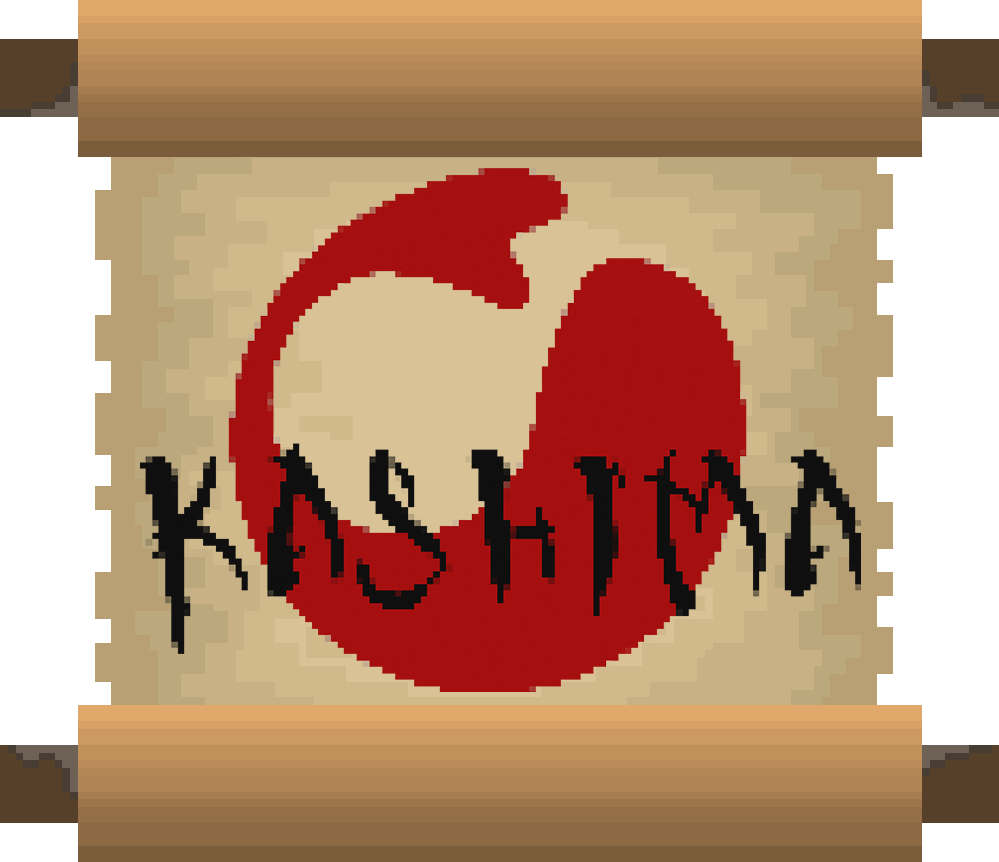

  

___

**Kashima** is a Jump'n'Run game featuring a unique tilt mechanic, set in a mythical Japanese environment. It was developed during the summer semester of 2020 as part of the courses _Interactive Systems_ and _Media Design_ at TH Koeln. This was the first game ever created by everyone on the development team. Download the submitted version of the game [here](https://github.com/Knerten0815/Jump-n-Tilt/releases/latest). Or clone this repository and run the project in Unity.  

# Kashima
Long ago, the giant catfish Onamazu was feared for causing horrible earthquakes whenever it moved. The mighty god Kashima pacified the land from this threat, by pinning down the fish with a massive boulder and guarding it ever since. Now, centuries later, the boulder has been shattered, and the catfish is set free again. Take on the role of Kashima and find out who caused this heresy.

https://github.com/user-attachments/assets/7194654a-80fd-4171-b3c9-ddec5e3dc91d
